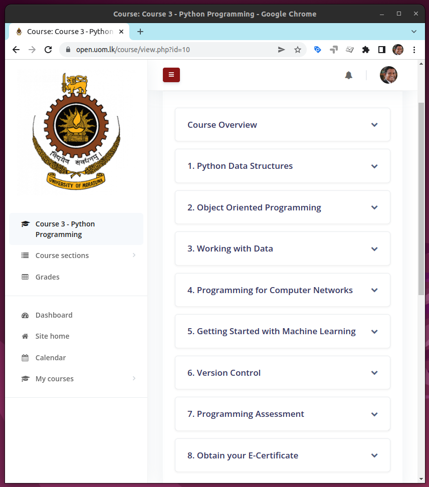
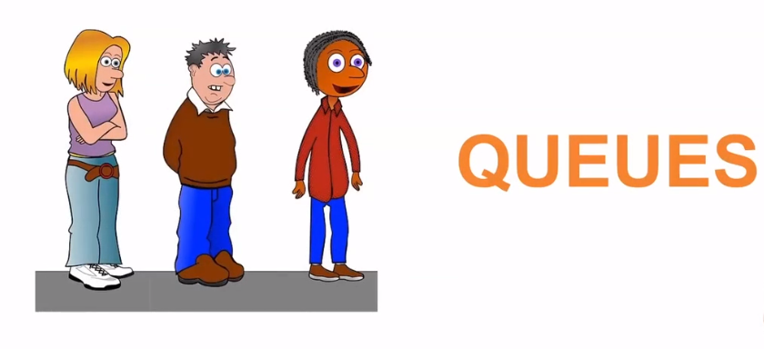
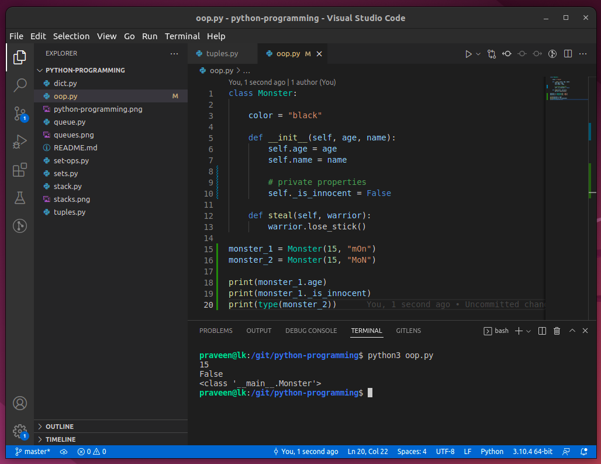
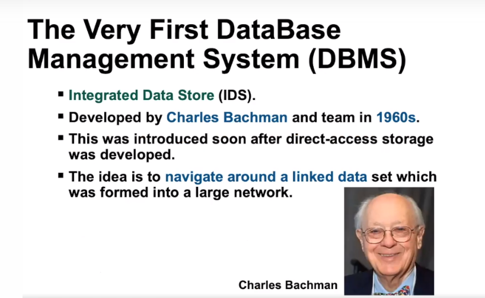
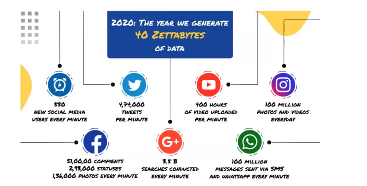
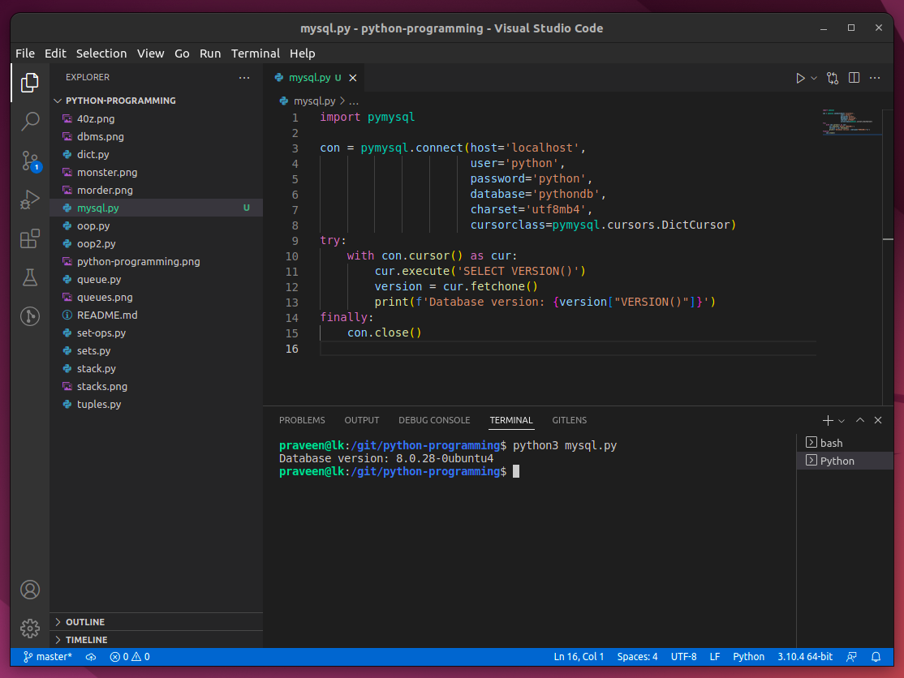
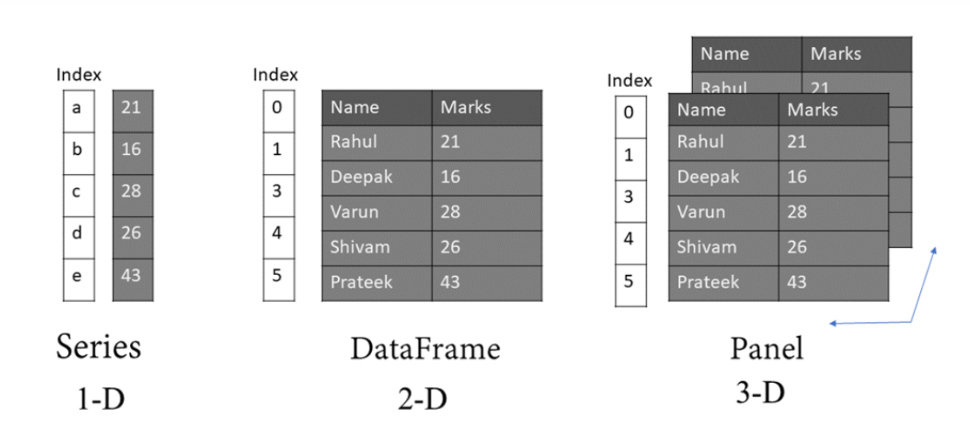
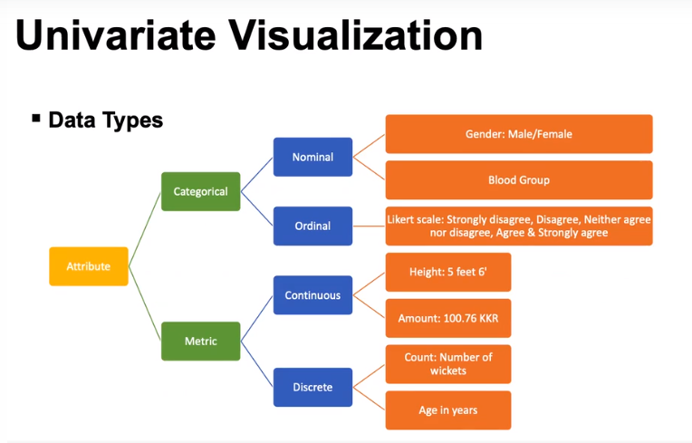

# Python Programming



# Lists as Stacks and Queues




# Sets

```
fruits = {'apple', 'orange', 'banana'}
fruits = set(['orange', 'apple', 'mango'])
```

# Dictionary

```
my_first_dict = dict()
scores = {'Saman': 70, 'Praveen': 100, 'Kamal': 20}
```

# Game Development

Simple game development with Python Object Oriented Programming.


## Creating Monsters



# Python Databases



## 40 Zettabytes of DATA

### Meet BigDATA



## PyMySQL



## Pandas



# Data Visualization

